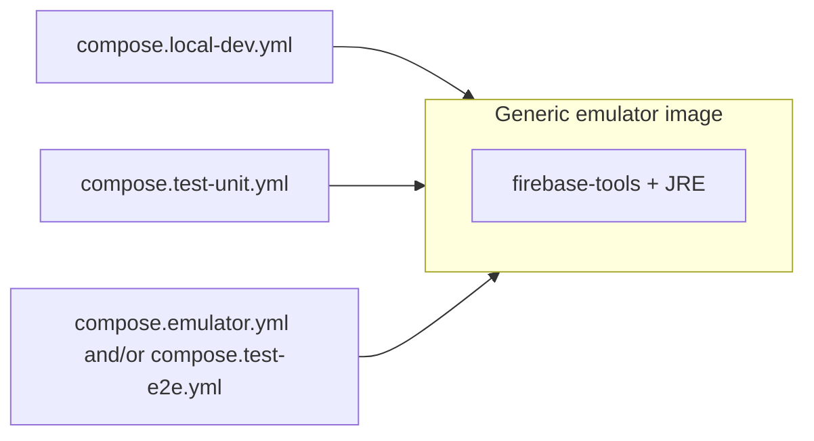

# Plan: Firebase emulators in Docker (dev, test-unit, full emulator, E2E)

This document is the **structured implementation plan** for running Firebase emulators in Docker across local hybrid development, API unit tests, full emulator hosting, and Playwright E2E. It supersedes ad hoc host-only emulator processes and aligns compose files with a **single generic emulator image**, with **per-environment config and commands** declared in compose.

**Related docs:** [Unit testing — Sapie](unit_testing_sapie.md), [Unit testing implementation plan](unit_testing_implementation_plan.md) (Phase 2 describes the original test container; update its file names and commands after this refactor if they change).

---

## 1. Purpose and scope

### 1.1 Problem

- Local Firebase emulators started on the host sometimes fail to shut down cleanly, leaving ports and Java processes occupied and breaking the next start.
- Hybrid development (`scripts/dev-local.sh`) backgrounds the emulator process and relies on cleanup scripts and signals; this is fragile and harder for tooling (including AI agents) to reproduce.
- The test-unit stack already uses Docker (`Dockerfile.emulator-test-unit`, `compose.test-unit.yml`), but the image is tied to a single config baked at build time.

### 1.2 Intent

- Run emulators in **Docker** for **local hybrid dev** and keep **test-unit** on Docker, using one **generic** Dockerfile.
- Use **default emulator ports on the host** for local dev so `packages/web` and `packages/api` `.env.local-dev` (and similar) need no port churn.
- Keep **`firebase.test-unit.json`** for unit tests (non-default ports are acceptable to avoid clashes with local-dev defaults when both workflows exist; see §4).
- Add **`firebase.local-dev.json`** (or equivalent) so emulators bind **`0.0.0.0`** inside the container while keeping the same **logical** ports as today’s dev expectations (Firestore 8080, Auth 9099, UI 4000, Storage when enabled, plus hub/logging as needed).
- Preserve **import/export** for hybrid local dev (`./firebase/data`); developers reset state by **deleting** that directory.
- **E2E:** do **not** persist emulator data in the first iteration; optional import/export for debugging can be added later.

### 1.3 Non-goals (this pass)

- Moving Vite or NestJS into Docker.
- Changing production Firebase configuration.
- Implementing spaced repetition or other product features.

---

## 2. Decisions (frozen for implementation)

| Topic | Decision |
|--------|-----------|
| Dockerfile | One **generic** image: Node + JRE + pinned `firebase-tools`; copy **`.firebaserc`**; do **not** bake a single `firebase.json` into the image if avoidable—prefer **runtime** `--config` via compose `command` or a mounted config. |
| Local dev project | **`local-dev`** alias → `demo-local-dev` per [`.firebaserc`](../../.firebaserc). |
| Local dev Firebase config | Prefer **`firebase.local-dev.json`** (emulator-only shape, `host: 0.0.0.0`, default ports). Root **`firebase.json`** stays the source of truth for hosting/functions/deploy; only adjust if we need to avoid duplication without drift. |
| Storage in local dev | Include **Storage** in `--only` for local-dev compose even though the app does not use it yet, so the next feature does not require compose changes. Expose the **default Storage emulator port** in compose when present in config. |
| Test-unit | Keep **`firebase.test-unit.json`** and existing port scheme unless we explicitly standardize on “one stack at a time” and simplify ports later. |
| E2E data | **No** persistent export directory for E2E in v1; ephemeral runs only. Revisit if failed-run debugging needs a fixture export. |
| Playwright | Replace or complement **in-process** `webServer` emulator start with **Docker compose** + **`reuseExistingServer`** (or a root script that runs compose then Playwright), so the suite does not spawn host emulators. |
| Emulator cache | Continue mounting **`./firebase/emulator-cache`** (or equivalent) into the container for faster cold starts, consistent with test-unit. |

---

## 3. Current inventory (repo)

| Artifact | Role |
|----------|------|
| [`Dockerfile.emulator-test-unit`](../../Dockerfile.emulator-test-unit) | Builds image with **`firebase.test-unit.json`** copied as `firebase.json`; fixed `CMD`. |
| [`compose.test-unit.yml`](../../compose.test-unit.yml) | Maps test-unit ports; cache volume; tmpfs for Firestore data. |
| [`firebase.test-unit.json`](../../firebase.test-unit.json) | Emulator ports 8181 / 9160 / 9199 / 4001 / hub / logging; `0.0.0.0`. |
| [`firebase.json`](../../firebase.json) | Hosting, functions, emulators (default-style ports); used by full emulator and CLI. |
| [`scripts/dev-local.sh`](../../scripts/dev-local.sh) | Hybrid dev: host emulators + import/export + web/API background. |
| [`scripts/build-run-firebase-emulator.sh`](../../scripts/build-run-firebase-emulator.sh) | Build all for **`emulator`**, then `firebase emulators:start --project emulator`. |
| [`packages/test-e2e/playwright.config.ts`](../../packages/test-e2e/playwright.config.ts) | `webServer` runs `firebase emulators:start --project test-e2e`, waits on Functions URL. |
| [`scripts/cleanup-firebase.sh`](../../scripts/cleanup-firebase.sh) | Kills host emulator processes and ports; **TODOs** note imprecision. |

---

## 4. Target architecture

### 4.1 One image, multiple compose files

- **Build context:** repository root (same as today).
- **Per compose file:** `command` (and optionally `environment`) selects `--config`, `--project`, `--only`, and import/export flags.
- **Volumes:** local-dev binds **`./firebase/data`** for import/export; bind **`./firebase/emulator-cache`** for downloads cache; test-unit may keep **tmpfs** for Firestore data and **no** durable export.

Exact compose **filenames** are a project convention: e.g. `compose.local-dev.yml`, keep `compose.test-unit.yml` or rename consistently in scripts—pick one naming scheme and update all references (`package.json`, CI, docs).

### 4.2 Environment flows (after refactor)

| Flow | Apps | Emulators | Notes |
|------|------|-----------|--------|
| **local-dev** | Vite + Nest on host | Docker (`local-dev`, import/export `./firebase/data`) | `dev-local.sh` starts compose (or attaches), then web/API; trap runs `compose down`. |
| **emulator** (full) | Served via Firebase Hosting + Functions in emulator | Docker (`emulator` → `demo-emulator`) | Requires **built** `packages/web/dist` and `packages/api/dist` available to the emulator (mount or build stage); mirror current `build-run-firebase-emulator.sh` semantics. |
| **test-unit** | Jest in `packages/api` | Docker (`demo-test-unit`, `firebase.test-unit.json`) | Env vars remain `localhost:<test-port>`. |
| **test-e2e** | Playwright | Docker (`test-e2e` → `demo-test-e2e`) | No data persistence v1; readiness URL must match Functions/Hosting as today. |

---

## 5. Configuration files

### 5.1 New: `firebase.local-dev.json`

- **Emulators:** Auth, Firestore, Storage, UI (and hub/logging if required for debugging or CLI).
- **Hosts:** `0.0.0.0` for each emulator entry that must accept traffic from the host through Docker port publishing.
- **Ports:** Align with existing hybrid dev expectations (see `dev-local.sh` echo lines: UI **4000**, Auth **9099**, Firestore **8080**; add Storage default when enabled—avoid clashing with Auth; follow Firebase defaults from `firebase.json` / CLI docs).
- **Single project mode:** match existing pattern if used elsewhere.

### 5.2 Keep: `firebase.test-unit.json`

- No change unless we deliberately collapse to default ports (optional follow-up).

### 5.3 Full emulator and E2E

- **Option A:** Reuse root `firebase.json` inside the container with `--config firebase.json` and ensure emulator `host` entries allow Docker (may require a **`firebase.emulator-hosting.json`** overlay if we must not change localhost binding for non-Docker use—decide during implementation).
- **Option B:** Small dedicated **`firebase.full-emulator.json`** (and optionally **`firebase.test-e2e.json`**) that duplicates only emulator + hosting + functions paths needed for `emulators:start`, with `0.0.0.0` bindings.

Prefer the option that minimizes drift from `firebase.json` and keeps `firebase deploy` unaffected.

---

## 6. Implementation phases

### Phase A — Generic Dockerfile

1. Rename or refactor [`Dockerfile.emulator-test-unit`](../../Dockerfile.emulator-test-unit) to a **neutral** name (e.g. `Dockerfile.firebase-emulators`).
2. Install OS deps + pinned `firebase-tools` (keep or bump pin consistently).
3. Copy **`.firebaserc`**; copy **no** fixed `firebase.json` **or** copy a minimal stub—prefer supplying config via compose `command` + bind-mounted file from repo (avoids rebuild when JSON changes).
4. `EXPOSE`: document a superset of ports used across profiles, or rely on compose `ports` only (Docker does not require EXPOSE for mapping).
5. Default `CMD` can be a no-op or `firebase --version`; real start is always via compose.

**Verify:** `docker build -f Dockerfile.firebase-emulators .` succeeds.

### Phase B — Compose: local dev

1. Add **`compose.local-dev.yml`** (name per convention) with:
   - Build from generic Dockerfile.
   - `command:` `firebase emulators:start --config firebase.local-dev.json --project local-dev --only=auth,firestore,storage,...` plus **`--import`** / **`--export-on-exit`** pointing at a path inside the container that is bind-mounted to **`./firebase/data`**.
   - Volumes: `./firebase/data`, `./firebase/emulator-cache`.
   - `ports:` map **host defaults** ↔ container (same numeric ports).
2. Update **`scripts/dev-local.sh`**: call `docker compose ... up` (detached or foreground in a subshell—choose one documented pattern); remove background `firebase emulators:start`; keep web/API starts and **trap** `docker compose ... down` (or `stop`).
3. Revisit **`scripts/cleanup-firebase.sh`**: either narrow it to “legacy host emulators” or add **`docker compose ... down`** for the local-dev project name; avoid killing unrelated Java/Node processes.

**Verify:** From repo root, hybrid dev: emulators UI and ports reachable; web and API connect; Ctrl+C stops stack; data survives restart when `./firebase/data` is present; delete directory resets.

### Phase C — Compose: test-unit

1. Point **`compose.test-unit.yml`** at the **generic** Dockerfile.
2. Set `command:` to use **`firebase.test-unit.json`**, project **`demo-test-unit`** (or alias **`test-unit`** per CLI), `--only` matching today (firestore, auth, ui).
3. Retain **tmpfs** and cache volume behavior.
4. Update any **`scripts/start-test-emulator.sh`** / **`stop-test-emulator.sh`** / CI references to new Dockerfile name if changed.

**Verify:** `docker compose -f compose.test-unit.yml up -d` then `pnpm test` in `packages/api` passes; same failure mode as today when container is down.

### Phase D — Full emulator (`pnpm emulator`)

1. Add **`compose.emulator.yml`** (or extend a base file with [profiles](https://docs.docker.com/compose/profiles/)) that:
   - Mounts or uses built artifacts under `packages/web/dist` and `packages/api/dist`.
   - Runs `firebase emulators:start --project emulator` with the correct `--config`.
2. Update **`scripts/build-run-firebase-emulator.sh`**: after `scripts/build-all.sh emulator`, start compose instead of host CLI (or start compose with a pre-build step documented in README).

**Verify:** `pnpm emulator` (or equivalent) serves app through emulator URLs as before.

### Phase E — E2E

1. Add **`compose.test-e2e.yml`** (or profile) for project **`test-e2e`**, same functional surface as Playwright expects (Functions URL, Hosting if `baseURL` is hosting, etc.).
2. **No** `./firebase/data-test-e2e` in v1.
3. Update **`packages/test-e2e/playwright.config.ts`**: `reuseExistingServer: true` locally; document `docker compose ... up` before `pnpm test`; on CI, either run compose in a job step or use a wrapper script.
4. Update **`packages/test-e2e/README.md`** with the new flow.

**Verify:** With compose up, Playwright passes (or fails only on real test failures); no reliance on host `firebase emulators` for E2E.

### Phase F — Documentation and drift cleanup

Execute the **master documentation checklist** in [§7](#7-documentation-to-update-master-checklist). During implementation, also fix historical drift (e.g. `unit_testing_implementation_plan.md` still references `docker-compose.test.yml` while the repo uses `compose.test-unit.yml`).

---

## 7. Documentation to update (master checklist)

Review each item after the Docker refactor; strike or update instructions that assume **host** `firebase emulators:start` where the standard path is now **Docker Compose**.

| Location | What to verify or update |
|----------|---------------------------|
| [`README.md`](../../README.md) | Emulator / local-dev / test flows; `pnpm dev`, `pnpm emulator`, unit tests; Docker Compose commands; troubleshooting (no more `pkill` as primary fix). |
| [`docs/dev/README.md`](README.md) | Already indexes this plan; add a one-line pointer to “emulators via Compose” if helpful. |
| [`docs/dev/contributing_guidelines.md`](contributing_guidelines.md) | Verify script names, prerequisite (Docker), and how to run API tests with the test emulator. |
| [`docs/dev/unit_testing_sapie.md`](unit_testing_sapie.md) | Emulator host ports and env vars if they are spelled out; align with `firebase.test-unit.json`. |
| [`docs/dev/unit_testing_implementation_plan.md`](unit_testing_implementation_plan.md) | Phase 2 Step 3+: compose filename, Dockerfile name, `docker compose` invocations. |
| [`docs/dev/ai_agent_guidelines.md`](ai_agent_guidelines.md) | Short, copy-paste steps: which compose file for which task (local-dev, test-unit, E2E, full emulator). |
| **This plan** ([`firebase_emulators_docker_plan.md`](firebase_emulators_docker_plan.md)) | Add an **Implementation status** footer (date, PR) when work lands. |
| [`packages/api/README.md`](../../packages/api/README.md) | “Full emulator” and local-dev sections; health URLs; any “install Firebase CLI for emulators” wording. |
| [`packages/web/README.md`](../../packages/web/README.md) | If it documents env files or emulator ports, align with Compose. |
| [`packages/test-e2e/README.md`](../../packages/test-e2e/README.md) | Automatic vs manual emulator startup; Compose-first workflow; CI note if applicable. |
| [`docs/other/nestjs_firebase_integration.md`](../other/nestjs_firebase_integration.md) | Localhost emulator references remain valid; mention Docker only if the doc describes “how to start” emulators. |
| [`docs/research/firebase/save_data_firebase_emulator.md`](../research/firebase/save_data_firebase_emulator.md) | If it describes import/export paths, ensure they match bind-mounted `./firebase/data` for local-dev. |

**Optional:** [`.cursor/rules/general.mdc`](../../.cursor/rules/general.mdc) — only if you want the canonical agent ramp-up to mention Compose-based emulators explicitly.

---

## 8. Scripts, Compose, and automation to update (master checklist)

| Artifact | Action |
|----------|--------|
| [`scripts/dev-local.sh`](../../scripts/dev-local.sh) | Start/stop **local-dev** emulators via Compose; trap `compose down`; adjust echoed URLs if ports change. |
| [`scripts/build-run-firebase-emulator.sh`](../../scripts/build-run-firebase-emulator.sh) | After build, start **full emulator** via Compose (or documented equivalent); avoid host `firebase emulators:start` as the default. |
| [`scripts/cleanup-firebase.sh`](../../scripts/cleanup-firebase.sh) | Narrow or replace **pkill** / port-kill logic; prefer `docker compose … down` for named projects; document when host cleanup is still needed. |
| [`scripts/cleanup-firebase-data.sh`](../../scripts/cleanup-firebase-data.sh) | Confirm whether it should touch **Docker** cache dirs or only `.firebase/` on host; align comments with behavior. |
| [`scripts/build-test-all.sh`](../../scripts/build-test-all.sh) | Order of operations vs test emulator (today calls `cleanup-firebase.sh`); remove duplicate `pnpm test` block if still present; ensure tests target the correct emulator ports. |
| [`scripts/test-emulator-start.sh`](../../scripts/test-emulator-start.sh) | Point `COMPOSE_FILE` at test-unit compose; optional flags (`-d`); align container/service names after refactors. |
| [`scripts/test-emulator-stop.sh`](../../scripts/test-emulator-stop.sh) | Same compose file and service naming as start script. |
| [`scripts/test-emulator-remove.sh`](../../scripts/test-emulator-remove.sh) | `docker compose down` options vs new Dockerfile service name; do not drop dev data volumes by mistake. |
| [`scripts/verify-all.sh`](../../scripts/verify-all.sh) | Only if it references emulators or Docker. |
| **New scripts (optional)** | Wrapper: `scripts/compose-emulators-local-dev.sh` / `…-test-e2e.sh` if it reduces duplication between README and CI. |
| **[`compose.test-unit.yml`](../../compose.test-unit.yml)** (and renames) | Generic image, `command`, volumes, ports. |
| **New compose files** | `compose.local-dev.yml`, `compose.emulator.yml`, `compose.test-e2e.yml` (names per §4). |
| **[`Dockerfile.emulator-test-unit`](../../Dockerfile.emulator-test-unit)** (or successor) | Generic build; update every `docker build` / CI reference. |
| **[`package.json`](../../package.json)** (root) | `emulator` and `dev` scripts still correct; add scripts for `compose up` helpers if desired. |
| **CI workflows** | If/when `.github/workflows` run API tests, add steps to start the test-unit compose stack (and tear down). Currently absent in-repo; add to this table when introduced. |

---

## 9. Verification matrix (acceptance)

| Check | Command / action | Expected |
|-------|------------------|----------|
| Local hybrid | `./scripts/dev-local.sh` (or compose + manual web/api) | UI/API work; emulators on expected localhost ports; clean stop. |
| Full emulator | `pnpm emulator` | Hosting + functions behavior unchanged vs pre-refactor. |
| API unit tests | Compose test-unit up → `pnpm test` in `packages/api` | All tests pass. |
| E2E | Compose test-e2e up → `pnpm test` in `packages/test-e2e` | Suite runs against emulators (tests may be skipped/disabled today—still verify wiring). |
| Agent / clean machine | Clone, install, follow README emulator section | No undocumented host Firebase install required for standard flows (optional: keep host CLI as advanced). |

---

## 10. Risks and mitigations

| Risk | Mitigation |
|------|------------|
| Emulator advertises wrong host URLs | Use **same** port inside container and on host; avoid asymmetric port maps for Firestore/UI. |
| `firebase.json` vs Docker `host` | Use **`firebase.local-dev.json`** / dedicated full-emulator config with `0.0.0.0`. |
| Full emulator image size / build time | Cache layers; mount `dist` from host after `build-all.sh`. |
| `cleanup-firebase.sh` too aggressive | Scope kills to documented ports or deprecate in favor of compose down. |

---

## 11. Deferred (optional later)

- E2E or CI: **export on failure** to `./firebase/data-test-e2e-debug` for inspection.
- Collapse test-unit to **default ports** if “one emulator at a time” is always true.
- Compose **profiles** to merge YAML files if four files feel redundant.

---

## 12. Checklist summary

- [ ] Generic Dockerfile + naming
- [ ] `firebase.local-dev.json`
- [ ] `compose.local-dev.yml` + `dev-local.sh` + cleanup script review
- [ ] `compose.test-unit.yml` migration + scripts/CI
- [ ] `compose.emulator.yml` + `build-run-firebase-emulator.sh`
- [ ] `compose.test-e2e.yml` + Playwright + README
- [ ] [§7 — Documentation](#7-documentation-to-update-master-checklist): all rows reviewed
- [ ] [§8 — Scripts & automation](#8-scripts-compose-and-automation-to-update-master-checklist): all rows reviewed

When this checklist is complete, mark this document with an **Implementation status** section at the bottom (date + link to PR) or archive it per team habit.
