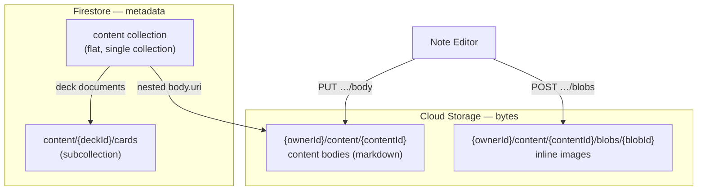
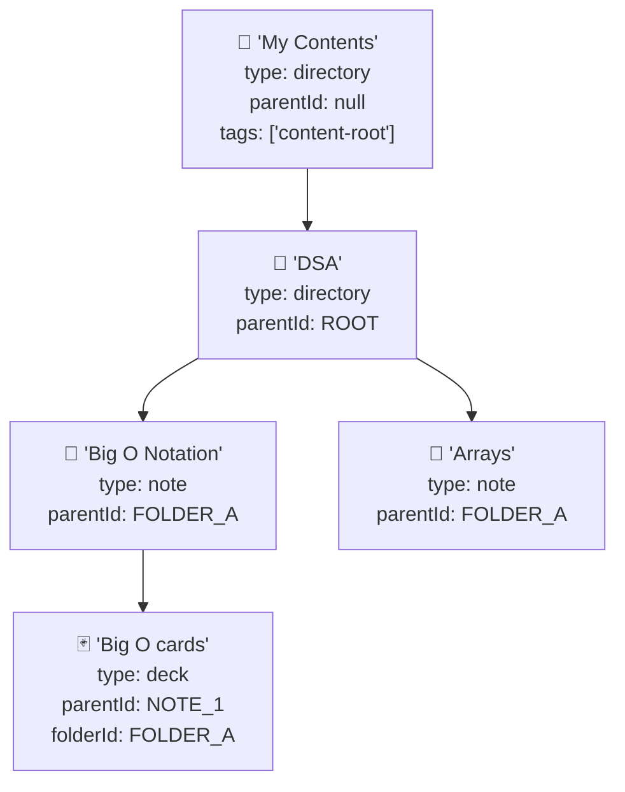

# Storage Model

Sapie uses **Firebase Firestore** for metadata and **Firebase Cloud Storage (GCS)** for payload bytes (content bodies and inline image blobs). The two stores are linked by a nested `body` object in Firestore documents that carries the GCS object path, size, and MIME type.

---

## Overview

---

## Firestore: `content` collection

All content — directories, notes, and flashcard decks — lives in a single flat `content` collection. The tree structure is modeled via `parentId` pointers, not nested documents.

### Content types

|`type`|Represents|Can have children?|Can have body?|
|---|---|---|---|
|`directory`|Folder in the sidebar tree|Other directories and notes|No|
|`note`|Markdown document|Decks only|Yes (markdown)|
|`deck`|Flashcard deck|Cards (subcollection)|No|

### Document fields

|Field|Type|Description|
|---|---|---|
|`name`|`string`|Display name; unique among siblings under the same `parentId`|
|`type`|`"directory" \| "note" \| "deck"`|Content type|
|`parentId`|`string \| null`|Parent content ID; `null` only for root directories|
|`folderId`|`string \| null`|**Denormalized.** Set on decks only — the parent note's folder. Enables efficient folder-level study queries (`WHERE folderId IN […]`)|
|`ownerId`|`string`|Firebase Auth UID|
|`body`|`{ uri, size, mimeType, createdAt, updatedAt } \| null`|Nested storage metadata. `null` for directories and for notes before the first body save|
|`tags`|`string[] \| null`|Tags for categorization. Currently `"content-root"` marks user root folders|
|`deleted`|`boolean`|Soft-delete flag|
|`deletedAt`|`Timestamp \| null`|When soft-deleted|
|`deletedBy`|`{ uid: string } \| null`|Who soft-deleted it|
|`createdAt`|`Timestamp`|Creation timestamp|
|`updatedAt`|`Timestamp`|Metadata change timestamp (rename, tags). **Not** the body revision signal — use `body.updatedAt` for that|

### Tree structure

- Folders contain folders and notes.
- Notes contain decks.
- Decks are **not shown in the sidebar tree** — only folders and notes appear.
- Decks store a denormalized `folderId` for efficient folder-level study queries (`WHERE type=deck AND folderId IN […]`).

---

## Firestore: `cards` subcollection

Cards live under deck documents: `content/{deckId}/cards/{cardId}`. This is a Firestore subcollection, not a top-level collection.

### Card document fields

|Field|Type|Description|
|---|---|---|
|`deckId`|`string`|Parent deck ID (implicit from path)|
|`ownerId`|`string`|Firebase Auth UID|
|`front`|`string`|Question/prompt|
|`back`|`string`|Answer|
|`dueDate`|`Timestamp`|Next review date|
|`interval`|`number`|Days until next review (SM-2)|
|`repetitions`|`number`|Consecutive "know" count|
|`lastResult`|`"know" \| "dont_know" \| null`|Last study outcome|
|`lastStudied`|`Timestamp \| null`|When last studied|
|`correctCount`|`number`|Total "know" responses|
|`incorrectCount`|`number`|Total "don't know" responses|
|`deleted`|`boolean`|Soft-delete flag|
|`deletedAt`|`Timestamp \| null`|When soft-deleted|
|`createdAt`|`Timestamp`|Creation timestamp|
|`updatedAt`|`Timestamp`|Last update timestamp|

### Scheduled repetition (SM-2)

The study algorithm is a simplified SM-2 (pre-FSRS):

- **"know"**: `interval = min(2^repetitions, 365)` days, `dueDate = now + interval`. Repetitions increment.
- **"dont_know"**: `interval = 0`, `dueDate = now` (due immediately). Repetitions reset to 0.

The data model stores `interval`, `repetitions`, `lastResult`, and `dueDate` — designed for future FSRS upgrade without schema migration.

---

## Cloud Storage (GCS)

Content bodies and blob images are stored in Firebase Cloud Storage. The bucket is configured via `FIREBASE_CONFIG.storageBucket`.

### Object paths

|Purpose|Path pattern|Mutable?|Cache|
|---|---|---|---|
|Content body|`{ownerId}/content/{contentId}`|Yes (PUT replaces)|`private, max-age=3600`|
|Inline blob|`{ownerId}/content/{contentId}/blobs/{blobId}`|No (immutable)|`private, max-age=31536000, immutable`|

- `blobId` is a 12-character nanoid, auto-generated on upload.
- Blobs are **immutable** — a blob ID is never overwritten. If the user replaces an image, a new blob is uploaded with a new ID.
- Content bodies are **mutable** — `PUT …/body` replaces the object.

### Max body size

**2 MiB** (`CONTENT_BODY_MAX_BYTES`) for both content bodies and blobs. Enforced server-side with `413 Payload Too Large`.

### Read access

- **`GET /api/content/:id/body`** — streams body bytes (server proxies from GCS). Cache: `private, no-cache`.
- **`GET /api/content/:id/body/signed-url`** — returns a V4 signed read URL (5 min TTL). Cache: `no-store`.
- **`GET /api/content/:contentId/blobs/:blobId`** — streams blob bytes. Cache: `private, max-age=31536000, immutable`.

Signed URLs in production use IAM `signBlob` (no local private key). The runtime service account must hold `roles/iam.serviceAccountTokenCreator` on itself.

### Write access

- **`PUT /api/content/:id/body`** — uploads raw bytes, updates `body` in Firestore. Notes require `expectedRevision` (optimistic concurrency via `body.updatedAt`). Returns `409` on conflict.
- **`POST /api/content/:contentId/blobs`** — uploads raw bytes, returns `{ blobId, url }`. No Firestore document is created for blobs.

---

## Soft-delete model

Deletion sets `deleted: true` + `deletedAt` + `deletedBy`. Permanent deletion of Firestore documents and GCS objects is **deferred** to the content versioning story.

|Content type|Cascade behavior|
|---|---|
|Note|Requires `?cascade=true` if content children (decks) exist. Cascades soft-delete to child decks.|
|Deck|Cascade soft-deletes all cards in the subcollection.|
|Directory|Recursively soft-deletes descendant folders and notes. **Limitation:** traversal stops at notes — decks and their cards are not soft-deleted when a directory is deleted.|

GCS blobs and bodies are **not deleted** on soft-delete.

---

## Key design decisions

1. **Single `content` collection** — all content types share one Firestore collection. Type is discriminated by the `type` field. This avoids Firestore's 1-write/doc/sec limit across collections and simplifies tree queries.

2. **Cards as a subcollection** — cards belong to decks via `content/{deckId}/cards`. This groups all cards under their deck for efficient listing and batch deletion.

3. **Denormalized `folderId` on decks** — avoids recursive Firestore queries when computing due cards for a folder. Deck creation snapshots the note's parent folder, enabling `WHERE folderId IN […]` direct queries.

4. **Blobs have no Firestore document** — blobs are pure GCS objects. No separate collection, no reconciliation. The one-step upload (`POST …/blobs`) returns a URL the client embeds in markdown (``).

5. **Optimistic concurrency on body saves** — note body writes require `expectedRevision` (`body.updatedAt` ISO string). Prevents two editors from silently clobbering each other's work.

6. **Immutable blob cache** — blob responses carry `max-age=31536000, immutable`. Once a blob URL is embedded in markdown, the browser never revalidates — images load from cache instantly.

7. **SM-2 scheduling with FSRS path** — card fields (`interval`, `repetitions`, `lastResult`, `dueDate`) are chosen so a future FSRS upgrade can compute initial parameters from existing data without a migration.

See also: [content_naming.md](content_naming.md) for terminology conventions.
