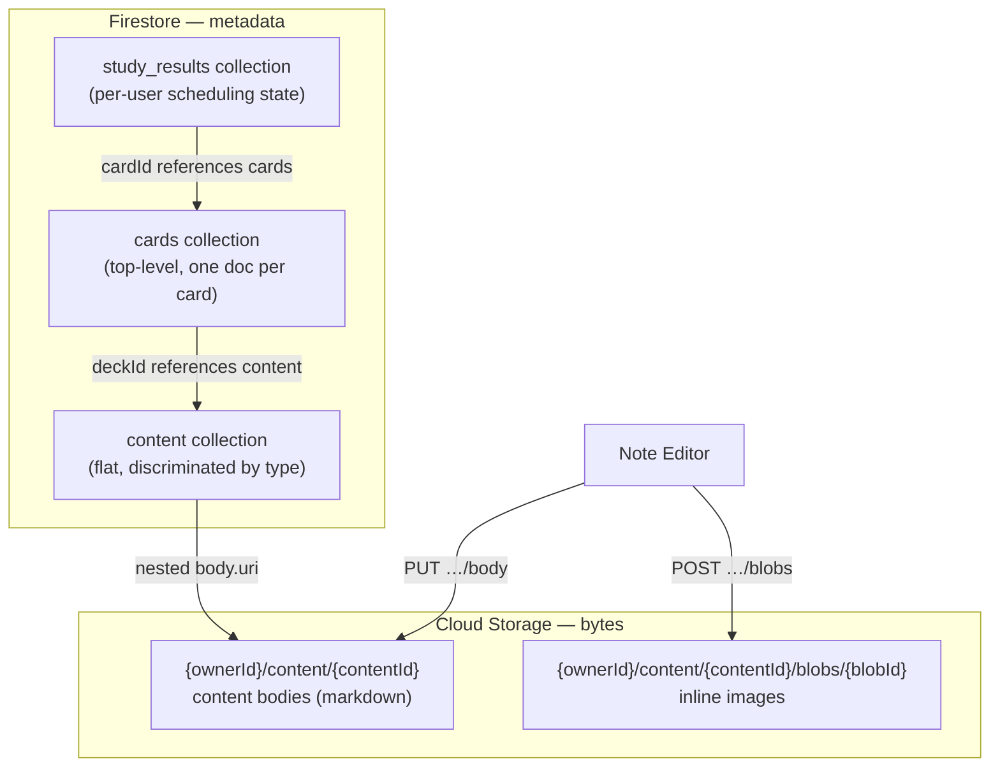
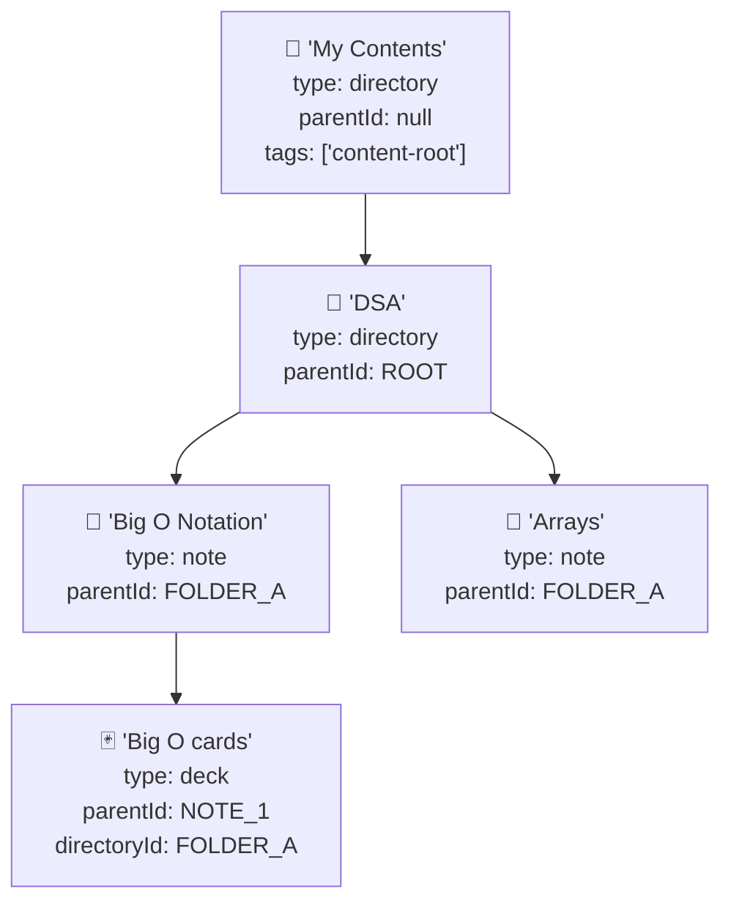

# Storage Model

Sapie uses **Firebase Firestore** for metadata and **Firebase Cloud Storage (GCS)** for payload bytes (content bodies and inline image blobs). The two stores are linked by a nested `body` object in Firestore documents that carries the GCS object path, size, and MIME type.

---

## Overview



---

## Domain types (discriminated union)

The `content` collection uses a **discriminated union** in the domain layer:

```typescript
type Content = Directory | Note | Deck;

interface BaseContent {
  id: string; name: string; parentId: string | null;
  ownerId: string; tags?: string[] | null;
  deleted?: boolean; deletedAt?: Date | null; deletedBy?: { uid: string } | null;
  createdAt: Date; updatedAt: Date;
}

interface Directory extends BaseContent { type: 'directory'; }
interface Note extends BaseContent { type: 'note'; body: ContentBody | null; }
interface Deck extends BaseContent {
  type: 'deck';
  description?: string;
  cardStyle?: 'qa' | 'cloze' | 'open_ended';
  defaultDepth?: 'foundation' | 'applied' | 'detail';
  language?: string;
  directoryId: string | null;  // denormalized from parent note's parentId
}
```

The `type` literal discriminant lets the compiler enforce validity (e.g. `body` only exists on `Note`, `directoryId` only exists on `Deck`). Firestore documents are flat; the `type` field drives type construction at the repository boundary.

---

## Collection map

|Collection|Purpose|Key queries|
|---|---|---|
|`content`|Tree metadata (directories, notes, decks). Flat, discriminated by `type`.|`WHERE parentId = ?`, `WHERE type = deck AND directoryId IN […]`|
|`cards`|Flashcard content (front/back markdown). Standalone, one doc per card.|`WHERE deckId = ? ORDER BY position`|
|`study_results`|Per-user study scheduling state. One doc per (user, card) pair.|`WHERE userId = ? AND cardId IN […] AND dueDate <= ?` – for due cards|
|`user_preferences` *(future)*|Per-user learning config.||
|`locks`|Sync locks for the CLI (if enabled).|`WHERE resourcePath = ?`|

---

## Content types

|`type`|Represents|Can have children?|Can have body?|
|---|---|---|---|
|`directory`|Folder in the sidebar tree|Other directories and notes|No|
|`note`|Markdown document|Decks only|Yes (markdown)|
|`deck`|Flashcard deck|No (cards are separate collection)|No|

---

## Document fields: `content` collection

|Field|Type|Description|
|---|---|---|
|`name`|`string`|Display name; unique among siblings under the same `parentId`|
|`type`|`"directory" \| "note" \| "deck"`|Content type|
|`parentId`|`string \| null`|Parent content ID; `null` only for root directories|
|`directoryId`|`string \| null`|**Denormalized.** Set on decks only — the parent note's directory. Enables efficient directory-level study queries (`WHERE type = deck AND directoryId IN […]`)|
|`ownerId`|`string`|Firebase Auth UID|
|`body`|`{ uri, size, mimeType, createdAt, updatedAt } \| null`|Nested storage metadata. Only on notes. `null` before the first body save|
|`description`|`string`|Deck-level description (deck type only)|
|`cardStyle`|`"qa" \| "cloze" \| "open_ended"`|Card format (deck type only)|
|`defaultDepth`|`"foundation" \| "applied" \| "detail"`|Default depth (deck type only)|
|`language`|`string`|Language code (deck type only)|
|`tags`|`string[] \| null`|Tags for categorization. `"content-root"` marks user root folders|
|`deleted`|`boolean`|Soft-delete flag|
|`deletedAt`|`Timestamp \| null`|When soft-deleted|
|`deletedBy`|`{ uid: string } \| null`|Who soft-deleted it|
|`createdAt`|`Timestamp`|Creation timestamp|
|`updatedAt`|`Timestamp`|Metadata change timestamp (rename, tags). **Not** the body revision signal — use `body.updatedAt` for that|

---

## Document fields: `cards` collection

|Field|Type|Description|
|---|---|---|
|`deckId`|`string`|Parent deck ID (references `content` doc)|
|`ownerId`|`string`|Firebase Auth UID|
|`position`|`number`|Ordinal position within the deck (0-based, monotonically assigned)|
|`front`|`string`|Question/prompt — markdown|
|`back`|`string`|Answer — markdown|
|`deleted`|`boolean`|Soft-delete flag|
|`deletedAt`|`Timestamp \| null`|When soft-deleted|
|`createdAt`|`Timestamp`|Creation timestamp|
|`updatedAt`|`Timestamp`|Last update timestamp|

**Composite indexes:** `(deckId, position)` for ordered deck listing.

---

## Document fields: `study_results` collection

|Field|Type|Description|
|---|---|---|
|`cardId`|`string`|References `cards` collection|
|`userId`|`string`|Firebase Auth UID of the learner|
|`dueDate`|`Timestamp`|Next review date|
|`interval`|`number`|Days until next review (SM-2)|
|`repetitions`|`number`|Consecutive "know" count|
|`lastResult`|`"know" \| "dont_know" \| null`|Last study outcome|
|`lastStudied`|`Timestamp \| null`|When last studied|
|`correctCount`|`number`|Total "know" responses|
|`incorrectCount`|`number`|Total "don't know" responses|
|`createdAt`|`Timestamp`|First study timestamp|
|`updatedAt`|`Timestamp`|Last update timestamp|

**Composite indexes:** `(userId, dueDate)` for the primary due-cards query.

---

## Tree structure



- Folders contain folders and notes.
- Notes contain decks.
- Decks are **not shown in the sidebar tree** — only folders and notes appear.
- Decks store a denormalized `directoryId` for efficient directory-level study queries.

---

## Cloud Storage (GCS)

Content bodies and blob images are stored in Firebase Cloud Storage.

### Object paths

|Purpose|Path pattern|Mutable?|Cache|
|---|---|---|---|
|Content body|`{ownerId}/content/{contentId}`|Yes (PUT replaces)|`private, max-age=3600`|
|Inline blob|`{ownerId}/content/{contentId}/blobs/{blobId}`|No (immutable)|`private, max-age=31536000, immutable`|

- `blobId` is a 12-character nanoid, auto-generated on upload.
- Blobs are **immutable** — a blob ID is never overwritten.
- Content bodies are **mutable** — `PUT …/body` replaces the object.

### Max body size

**2 MiB** (`CONTENT_BODY_MAX_BYTES`). Enforced server-side with `413 Payload Too Large`.

---

## Soft-delete model

Deletion sets `deleted: true` + `deletedAt` + `deletedBy`. Permanent deletion of Firestore documents and GCS objects is **deferred** to the content versioning story.

|Content type|Cascade behavior|
|---|---|
|Note|Requires `?cascade=true` if content children (decks) exist. Cascades soft-delete to child decks.|
|Deck|Cascade soft-deletes all cards in the `cards` collection via `softDeleteCardsByDeckId`.|
|Directory|Recursively soft-deletes descendant folders, notes, and decks.|

GCS blobs and bodies are **not deleted** on soft-delete.

---

## Key design decisions

1. **Single `content` collection** — all content types share one Firestore collection. Type is discriminated by the `type` field. The domain layer uses a discriminated union (`Directory | Note | Deck`) for compile-time type safety.

2. **Cards as a standalone collection** — cards live in a top-level `cards` collection, not as a subcollection. This enables direct queries (`WHERE deckId = ? ORDER BY position`) and clean separation of card content from study state.

3. **Study results as a separate collection** — per-user scheduling state lives in `study_results`. This decouples card content (immutable from a study perspective) from mutable study state, and enables multi-user support when decks are shared.

4. **Denormalized `directoryId` on decks** — avoids recursive Firestore queries when computing due cards for a directory. Deck creation snapshots the parent note's directory. If the note is moved, the note-move operation must update all child deck `directoryId` values.

5. **Blobs have no Firestore document** — blobs are pure GCS objects. No separate collection, no reconciliation.

6. **Optimistic concurrency on body saves** — note body writes require `expectedRevision` (`body.updatedAt` ISO string).

7. **Immutable blob cache** — blob responses carry `max-age=31536000, immutable`.

8. **SM-2 scheduling in `study_results` with FSRS path** — fields (`interval`, `repetitions`, `lastResult`, `dueDate`) are chosen so a future FSRS upgrade can compute initial parameters without a migration.

---

## See also

- [Content naming conventions](content_naming.md) — terminology
- [Storage model refactor](storage_model_refactor.md) — design decisions and migration notes
- [Innovative learning features brainstorm](../research/inovative_learning_features.md) — future features
- [Blob storage model proposal](../research/note_editor/blob_storage_model_proposal.md) — blob design rationale
