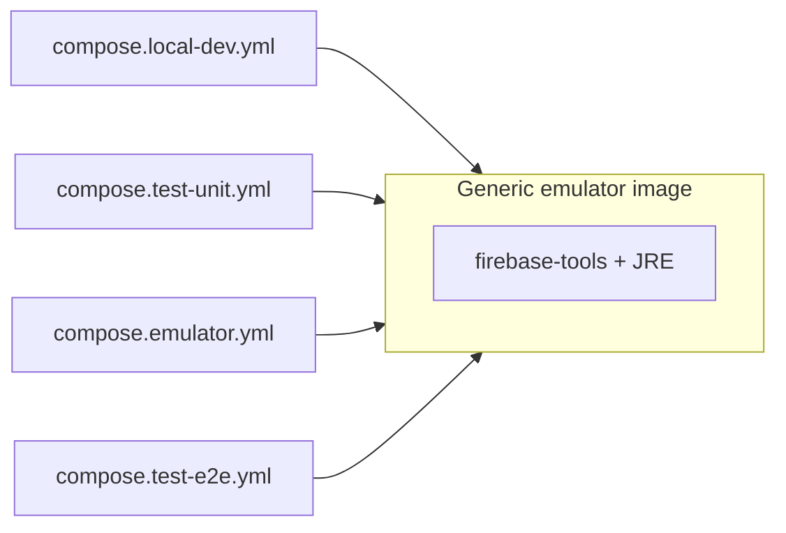

# Plan: Firebase emulators in Docker (dev, test-unit, full emulator, E2E)

This document is the **structured implementation plan** for running Firebase emulators in Docker for **local hybrid dev**, **test-unit**, and the **full emulator** (Hosting + Functions). **`pnpm emulator`** runs [`scripts/build-run-on-emulator.sh`](../../scripts/build-run-on-emulator.sh): `build-all.sh emulator`, cleanup, then [`compose.emulator.yml`](../../compose.emulator.yml) with **only** `packages/*/dist` mounts plus [`firebase.emulator.json`](../../firebase.emulator.json) (`0.0.0.0`). Compose uses one **generic** emulator image everywhere Docker applies.

**Related docs:** [Unit testing — Sapie](../dev/unit_testing_sapie.md), [Unit testing implementation plan](unit_testing_implementation_plan.md) (Phase 2 describes the original test container; update its file names and commands after this refactor if they change).

---

## 1. Purpose and scope

### 1.1 Problem

- Local Firebase emulators started on the host sometimes fail to shut down cleanly, leaving ports and Java processes occupied and breaking the next start.
- Earlier hybrid development could background **host** emulator processes; local-dev now uses **Docker Compose** for emulators (`scripts/dev-local.sh`), with cleanup and traps for web/API on the host.
- The test-unit stack uses Docker (`Dockerfile.firebase-emulators`, `compose.test-unit.yml`); emulator config is bind-mounted and the start command is set in compose (not baked into the image).

### 1.2 Intent

- Run emulators in **Docker** for **local hybrid dev** and keep **test-unit** on Docker, using one **generic** Dockerfile.
- Use **default emulator ports on the host** for local dev so `packages/web` and `packages/api` `.env.local-dev` (and similar) need no port churn.
- Keep **`firebase.test-unit.json`** for unit tests (non-default ports are acceptable to avoid clashes with local-dev defaults when both workflows exist; see §4).
- Add **`firebase.local-dev.json`** (or equivalent) so emulators bind **`0.0.0.0`** inside the container while keeping the same **logical** ports as today’s dev expectations (Firestore 8080, Auth 9099, UI 4000, Storage when enabled, plus hub/logging as needed).
- Preserve **import/export** for hybrid local dev (`./firebase/data-local-dev`); developers reset state by **deleting** export contents under that directory (or the whole tree except `.gitkeep` if preferred).
- **E2E:** do **not** persist emulator data in the first iteration; optional import/export for debugging can be added later.
- **Full emulator:** **`pnpm emulator`** → [`scripts/build-run-on-emulator.sh`](../../scripts/build-run-on-emulator.sh): build for **`emulator`**, then Docker Compose (**dist-only** mounts; no app source in the image). [`compose.emulator.yml`](../../compose.emulator.yml) runs **`pnpm install --prod --frozen-lockfile`** in **`packages/api`** using the mounted **`pnpm-lock.yaml`**, writing **`firebase/api-node_modules`** (Alpine image via [`Dockerfile.firebase-emulators`](../../Dockerfile.firebase-emulators) with Corepack `pnpm@10.12.1`).

### 1.3 Non-goals (this pass)

- Moving Vite or NestJS into Docker.
- Changing production Firebase configuration.
- Implementing spaced repetition or other product features.

---

## 2. Decisions (frozen for implementation)

| Topic | Decision |
|--------|-----------|
| Dockerfile | One **generic** image: Node + JRE + pinned `firebase-tools`; do **not** bake **`firebase.json`** or **`.firebaserc`** into the image—compose bind-mounts them at runtime. |
| Local dev project | **`local-dev`** alias → `demo-local-dev` per [`.firebaserc`](../../.firebaserc). |
| Local dev Firebase config | Prefer **`firebase.local-dev.json`** (emulator-only shape, `host: 0.0.0.0`, default ports). Root **`firebase.json`** stays the source of truth for hosting/functions/deploy; only adjust if we need to avoid duplication without drift. |
| Storage in local dev | Include **Storage** in `--only` for local-dev compose even though the app does not use it yet, so the next feature does not require compose changes. Expose the **default Storage emulator port** in compose when present in config. |
| Test-unit | Keep **`firebase.test-unit.json`** and existing port scheme unless we explicitly standardize on “one stack at a time” and simplify ports later. |
| E2E data | **No** persistent export directory for E2E in v1; ephemeral runs only. Revisit if failed-run debugging needs a fixture export. |
| Playwright | Replace or complement **in-process** `webServer` emulator start with **Docker compose** + **`reuseExistingServer`** (or a root script that runs compose then Playwright), so the suite does not spawn host emulators. |
| Emulator cache | Continue mounting **`./firebase/emulator-cache`** (or equivalent) into the container for faster cold starts, consistent with test-unit. |
| Full emulator (`pnpm emulator`) | [`scripts/build-run-on-emulator.sh`](../../scripts/build-run-on-emulator.sh): **`build-all.sh emulator`**, cleanup, then [`compose.emulator.yml`](../../compose.emulator.yml) — mounts **`packages/web/dist`**, **`packages/api/dist`**, [`firebase.emulator.json`](../../firebase.emulator.json), lockfiles, **`firebase/api-node_modules`**; **`firebase emulators:start`** in container (same generic image as local-dev/test-unit). |

---

## 3. Current inventory (repo)

| Artifact | Role |
|----------|------|
| [`Dockerfile.firebase-emulators`](../../Dockerfile.firebase-emulators) | Generic image: Node + JRE + pinned `firebase-tools`; compose bind-mounts **`.firebaserc`**, env **`firebase.<profile>.json` → `firebase.json`**, and sets **`command`**. |
| [`compose.test-unit.yml`](../../compose.test-unit.yml) | Maps test-unit ports; cache volume; tmpfs for Firestore data. |
| [`firebase.test-unit.json`](../../firebase.test-unit.json) | Emulator ports 8181 / 9160 / **9098** (auth) / 4001 / hub / logging; `0.0.0.0`. Auth is not 9199 so it does not clash with local-dev **Storage** on 9199. |
| [`firebase.json`](../../firebase.json) | Hosting, functions, emulators (default-style ports); deploy and CLI. Full emulator in Docker uses [`firebase.emulator.json`](../../firebase.emulator.json). |
| [`firebase.emulator.json`](../../firebase.emulator.json) | Same hosting/functions paths as root `firebase.json`; emulator `host: 0.0.0.0` for Docker publish. Mounted as `firebase.json` in [`compose.emulator.yml`](../../compose.emulator.yml). |
| [`compose.emulator.yml`](../../compose.emulator.yml) | Full stack in Docker: **dist-only** mounts; **`pnpm install --prod --frozen-lockfile`** into **`firebase/api-node_modules`** using **`packages/api/pnpm-lock.yaml`**. |
| [`scripts/dev-local.sh`](../../scripts/dev-local.sh) | Hybrid dev: Docker emulators (Compose) + web/API on host. |
| [`scripts/build-run-on-emulator.sh`](../../scripts/build-run-on-emulator.sh) | Build for **`emulator`** (`build-all.sh emulator`), cleanup, then `docker compose -f compose.emulator.yml up --build` (**`pnpm emulator`**). |
| [`packages/test-e2e/playwright.config.ts`](../../packages/test-e2e/playwright.config.ts) | `webServer` runs [`wait-emulator-ready.sh`](../../packages/test-e2e/scripts/wait-emulator-ready.sh) → **`GET /api/health`** on the Functions emulator; does not start Firebase on the host. |
| [`compose.test-e2e.yml`](../../compose.test-e2e.yml) | Same image/volumes/ports as full emulator; **`--project test-e2e`** → `demo-test-e2e`; optional **`healthcheck`** for `docker compose up --wait`. |

---

## 4. Target architecture

### 4.1 One image, multiple compose files

- **Build context:** repository root (same as today).
- **Per compose file:** `command` (and optionally `environment`) selects `--config`, `--project`, `--only`, and import/export flags.
- **Volumes:** local-dev binds **`./firebase/data-local-dev`** for import/export; bind **`./firebase/emulator-cache`** for downloads cache; test-unit may keep **tmpfs** for Firestore data and **no** durable export.

Exact compose **filenames** are a project convention: e.g. `compose.local-dev.yml`, keep `compose.test-unit.yml` or rename consistently in scripts—pick one naming scheme and update all references (`package.json`, CI, docs).

### 4.2 Environment flows (after refactor)

| Flow | Apps | Emulators | Notes |
|------|------|-----------|--------|
| **local-dev** | Vite + Nest on host | Docker (`local-dev`, import/export `./firebase/data-local-dev`) | `dev-local.sh` starts compose (or attaches), then web/API; trap runs `compose down`. |
| **emulator** (full) | Served via Firebase Hosting + Functions in emulator | Docker: [`scripts/build-run-on-emulator.sh`](../../scripts/build-run-on-emulator.sh) (`pnpm emulator`) | Requires **built** `packages/web/dist` and `packages/api/dist`. Same **logical** ports as `firebase.json`; do not run alongside **local-dev** Compose (shared 5000/8080/9099/…). **Requires Docker.** |
| **test-unit** | Jest in `packages/api` | Docker (`demo-test-unit`, `firebase.test-unit.json`) | Env vars remain `localhost:<test-port>`. |
| **test-e2e** | Playwright | Docker ([`compose.test-e2e.yml`](../../compose.test-e2e.yml); alias `test-e2e` → `demo-test-e2e`) | No data persistence v1; Playwright readiness = Functions **`/api/health`**; same ports as full emulator — one stack at a time. |

---

## 5. Configuration files

### 5.1 New: `firebase.local-dev.json`

- **Emulators:** Auth, Firestore, Storage, UI (and hub/logging if required for debugging or CLI).
- **Hosts:** `0.0.0.0` for each emulator entry that must accept traffic from the host through Docker port publishing.
- **Ports:** Align with existing hybrid dev expectations (see `dev-local.sh` echo lines: UI **4000**, Auth **9099**, Firestore **8080**; add Storage default when enabled—avoid clashing with Auth; follow Firebase defaults from `firebase.json` / CLI docs).
- **Single project mode:** match existing pattern if used elsewhere.

### 5.2 Keep: `firebase.test-unit.json`

- No change unless we deliberately collapse to default ports (optional follow-up).

### 5.3 Full emulator (Docker) and E2E

- **Implemented:** [`firebase.emulator.json`](../../firebase.emulator.json) duplicates hosting/functions **paths** from root [`firebase.json`](../../firebase.json) and adds **`0.0.0.0`** on emulator ports for Compose. **Host** full emulator keeps using root `firebase.json` (localhost defaults).
- **E2E:** remains separate (Playwright + `test-e2e` project); see Phase E and `packages/test-e2e`.

---

## 6. Implementation phases

### Phase A — Generic Dockerfile

1. ~~Rename or refactor `Dockerfile.emulator-test-unit` to a **neutral** name (e.g. `Dockerfile.firebase-emulators`).~~ **Done:** [`Dockerfile.firebase-emulators`](../../Dockerfile.firebase-emulators); old file removed.
2. Install OS deps + pinned `firebase-tools` (keep or bump pin consistently). **Done** (same pin as before: `firebase-tools@13.25.0`).
3. **No** `.firebaserc` or `firebase.json` in the image—compose bind-mounts **`.firebaserc`** and **`firebase.<env>.json` → `/srv/firebase/firebase.json`**. **Done.**
4. **`EXPOSE` omitted** in the image: it does not publish ports; each compose file lists `ports:` explicitly. **Done.**
5. Default `CMD` is `firebase --version`; real emulator start is via compose. **Done**.

**Test progress**

| Step | Command / action | Expected |
|------|------------------|----------|
| Image builds | From repo root: `docker build -f Dockerfile.firebase-emulators -t sapie-firebase-emulators:local .` (adjust `-f` / tag to match your chosen name) | Build completes with no errors. |
| CLI inside image | `docker run --rm sapie-firebase-emulators:local firebase --version` | Prints pinned Firebase CLI version. |
| API unit tests | **Only once** `compose.test-unit.yml` builds this image and supplies a valid `firebase emulators:start …` **command** (see Phase C). If Phase A alone removes or renames the Dockerfile that compose still references, the test stack may be broken until Phase C lands—prefer **one branch/PR that completes Phase A + C** before merging, or keep the previous Dockerfile path as a shim until then. When the test compose stack is wired: `docker compose -f compose.test-unit.yml up -d` then `cd packages/api && pnpm test` | Same pass/fail behavior as before refactor; with the emulator **down**, tests should fail to connect (confirms dependency on emulators). |

### Phase B — Compose: local dev

1. Add **`compose.local-dev.yml`** (name per convention) with:
   - Build from generic Dockerfile.
   - `command:` `firebase emulators:start --project local-dev --only=auth,firestore,storage,...` (config mounted as **`firebase.json`**) with **`--import`** and **`--export-on-exit`** on the bind-mounted data dir (directory must exist; if empty, the CLI skips import and logs a warning).
   - Volumes: `./firebase/data-local-dev`, `./firebase/emulator-cache`.
   - `ports:` map **host defaults** ↔ container (same numeric ports).
2. Update **`scripts/dev-local.sh`**: call `docker compose ... up` (detached or foreground in a subshell—choose one documented pattern); remove background `firebase emulators:start`; keep web/API starts and **trap** `docker compose ... down` (or `stop`).

**Test progress**

| Step | Command / action | Expected |
|------|------------------|----------|
| Emulators only | `docker compose -f compose.local-dev.yml up -d` (use the actual filename) | Container healthy; Emulator UI reachable at the documented URL (e.g. `curl -sf -o /dev/null -w "%{http_code}" http://localhost:4000` returns `200` or `302` as applicable). |
| Firestore / Auth ports | `curl -sf http://localhost:8080` (and/or Auth emulator root if you use a known path) | No connection refused on published ports after a short wait. |
| Full hybrid | `./scripts/dev-local.sh` (or equivalent) | Web and API start; sign-in or an API health check against emulators succeeds. |
| Clean shutdown | Stop via script `trap` / `docker compose … down` | No zombie emulator on host; `docker ps` shows local-dev container stopped (or removed). |
| Import/export | Create a doc in Firestore via app; `docker compose … down`; `docker compose … up -d` | Data still present when using existing `./firebase/data-local-dev`; after **clearing** that directory’s export files and starting fresh, empty or seed state as documented. |
| API unit tests (optional) | With local-dev compose **up**, `cd packages/api && pnpm test` | **Usually skip:** API unit tests typically use **test-unit** emulator ports (`firebase.test-unit.json`), not local-dev defaults. If you align env vars for a one-off check, interpret results carefully. Primary API test signal remains **Phase C**. |

### Phase C — Compose: test-unit

1. ~~Point **`compose.test-unit.yml`** at the **generic** Dockerfile.~~ **Done:** [`compose.test-unit.yml`](../../compose.test-unit.yml) → [`Dockerfile.firebase-emulators`](../../Dockerfile.firebase-emulators).
2. ~~Set `command:` for project **`demo-test-unit`**, `--only` matching today (firestore, auth, ui); config file is **`firebase.test-unit.json` on the host**, mounted as **`firebase.json`** in the container.~~ **Done** (same `command` and bind mount).
3. ~~Retain **tmpfs** and cache volume behavior.~~ **Done** (`tmpfs` `/srv/firebase/firestore-data`; `./firebase/emulator-cache`).
4. ~~Update any **`scripts/test-emulator-start.sh`** / **`test-emulator-stop.sh`** / **`emulator-test-unit-remove.sh`** / CI references to new Dockerfile name if changed.~~ **Done:** scripts use `compose.test-unit.yml`; start uses detached `up -d` (2026-04-08). No in-repo CI workflows reference the old Dockerfile name.

**Test progress**

| Step | Command / action | Expected |
|------|------------------|----------|
| Start stack | `docker compose -f compose.test-unit.yml up -d` | Container running; Emulator UI on test-unit port (e.g. `4001`). |
| API unit tests | `cd packages/api && pnpm test` | All tests pass. |
| Negative check | `docker compose -f compose.test-unit.yml stop` (or `down`), then `cd packages/api && pnpm test` | Suite fails in a way that shows Firestore/Auth emulator unreachable (confirms tests hit the container). |
| Helper scripts | `./scripts/test-emulator-start.sh` twice | Second run reports already running (if that behavior is kept). `./scripts/test-emulator-stop.sh` stops cleanly. |
| Repo test script | From repo root: `pnpm test` | Matches expectations for your pipeline (note: `verify-test-all.sh` may need the emulator already up or adjusted—align script order with reality). |

### Phase D — Full emulator (Docker)

**Model:** Hosting + Functions emulators consume **paths from `firebase.json`** — static `packages/web/dist` and compiled `packages/api/dist`. No app source in the container. Runtime **`require()`s** resolve from **`packages/api/node_modules`**, populated by **`pnpm install --prod --frozen-lockfile`** on each container start into the **`firebase/api-node_modules`** bind mount, using **`packages/api/pnpm-lock.yaml`** (read-only) for reproducibility.

1. **Entrypoint:** [`scripts/build-run-on-emulator.sh`](../../scripts/build-run-on-emulator.sh) → **`pnpm emulator`** — `build-all.sh emulator`, then [`compose.emulator.yml`](../../compose.emulator.yml) (generic [`Dockerfile.firebase-emulators`](../../Dockerfile.firebase-emulators)), mounts dist dirs + [`.firebaserc`](../../.firebaserc) + [`firebase.emulator.json`](../../firebase.emulator.json) + emulator cache + API lockfile.

**Optional later:** multi-stage image that `COPY` dist and runs `pnpm install` at **image build** time (faster cold start).

**Test progress**

| Step | Command / action | Expected |
|------|------------------|----------|
| Build | `scripts/build-all.sh emulator` (or via `pnpm emulator`, which invokes it) | `packages/web/dist` and `packages/api/dist` exist and are current. |
| Full stack | `pnpm emulator` | Docker container runs; Emulator UI / Hosting / Functions on expected localhost ports. |
| Hosting / Functions | Open Hosting URL (e.g. `http://localhost:5000`) and hit API via Functions URL | App loads, API responds. |
| Shutdown | Ctrl+C (stops compose) or `docker compose -f compose.emulator.yml down` | Container stopped; ports freed. |

### Phase E — E2E

1. **`compose.test-e2e.yml`**: same stack as [`compose.emulator.yml`](../../compose.emulator.yml) (Hosting + Functions + Auth + Firestore + UI), **`--project test-e2e`** (alias → **`demo-test-e2e`**), [`firebase.emulator.json`](../../firebase.emulator.json) mounted as `firebase.json`; **`healthcheck`** on API **`/api/health`** for `docker compose up --wait`.
2. **No** `./firebase/data-test-e2e` in v1.
3. **`packages/test-e2e/playwright.config.ts`**: readiness URL = Functions emulator health endpoint; **`reuseExistingServer: true`**; [`packages/test-e2e/scripts/wait-emulator-ready.sh`](../../packages/test-e2e/scripts/wait-emulator-ready.sh) polls then idles if the stack is still starting (Compose not required to be up before `pnpm test`, within timeout).
4. **`packages/test-e2e/README.md`**, root **`README.md`**, **`docs/dev/ai_agent_guidelines.md`**: Compose-first flow; port overlap with full emulator; alias vs `demo-` project id.

**Test progress**

| Step | Command / action | Expected |
|------|------------------|----------|
| Emulators up | `scripts/build-all.sh test-e2e` then `docker compose -f compose.test-e2e.yml up --build -d --wait` | Service **healthy**; `GET …/api/api/health` returns **200**. |
| No duplicate stack | Do not run `compose.emulator.yml` or host `firebase emulators:start` on the same ports | Single emulator suite; Playwright does not start Firebase on the host. |
| Run E2E | `cd packages/test-e2e && pnpm test` (or `pnpm test:headed`) | Tests hit Hosting **`localhost:5000`** and API via emulators; failures are assertions/timeouts, not connection refused. |
| CI | `build-all.sh test-e2e` → `docker compose -f compose.test-e2e.yml up --build -d --wait` → `pnpm test` in `packages/test-e2e` | Same as README / `ai_agent_guidelines.md`. |

### Phase F — Documentation and drift cleanup

Execute the **master documentation checklist** in [§7](#7-documentation-to-update-master-checklist). During implementation, also fix historical drift (e.g. `unit_testing_implementation_plan.md` still references `docker-compose.test.yml` while the repo uses `compose.test-unit.yml`).

**Test progress**

| Step | Command / action | Expected |
|------|------------------|----------|
| Spot-check commands | Copy the “start emulators” snippets from updated **README** and **`docs/dev/ai_agent_guidelines.md`** into a clean shell | Each snippet matches a real compose file and project name; no stale `docker-compose.test.yml` or wrong ports. |
| Full matrix | Run the checks in [§9](#9-verification-matrix-acceptance) | All environments still behave as described after doc-only changes (re-run if docs included a substantive command fix). |
| Links | Open changed markdown links (relative paths to scripts and compose files) | No broken paths. |

---

## 7. Documentation to update (master checklist)

Review each item after the Docker refactor; strike or update instructions that assume **host** `firebase emulators:start` where the standard path is now **Docker Compose**.

| Location | What to verify or update |
|----------|---------------------------|
| [`README.md`](../../README.md) | Emulator / local-dev / test flows; `pnpm dev`, `pnpm emulator`, unit tests; Docker Compose commands; troubleshooting (no more `pkill` as primary fix). |
| [`docs/dev/README.md`](../dev/README.md) | Already indexes this plan; add a one-line pointer to “emulators via Compose” if helpful. |
| [`docs/dev/contributing_guidelines.md`](../dev/contributing_guidelines.md) | Verify script names, prerequisite (Docker), and how to run API tests with the test emulator. |
| [`docs/dev/unit_testing_sapie.md`](../dev/unit_testing_sapie.md) | Emulator host ports and env vars if they are spelled out; align with `firebase.test-unit.json`. |
| [`docs/dev/unit_testing_implementation_plan.md`](unit_testing_implementation_plan.md) | Phase 2 Step 3+: compose filename, Dockerfile name, `docker compose` invocations. |
| [`docs/dev/ai_agent_guidelines.md`](../dev/ai_agent_guidelines.md) | Short, copy-paste steps: which compose file for which task (local-dev, test-unit, E2E, full emulator). |
| **This plan** ([`firebase_emulators_docker_plan.md`](firebase_emulators_docker_plan.md)) | Add an **Implementation status** footer (date, PR) when work lands. |
| [`packages/api/README.md`](../../packages/api/README.md) | “Full emulator” and local-dev sections; health URLs; any “install Firebase CLI for emulators” wording. |
| [`packages/web/README.md`](../../packages/web/README.md) | If it documents env files or emulator ports, align with Compose. |
| [`packages/test-e2e/README.md`](../../packages/test-e2e/README.md) | Automatic vs manual emulator startup; Compose-first workflow; CI note if applicable. |
| [`docs/other/nestjs_firebase_integration.md`](../other/nestjs_firebase_integration.md) | Localhost emulator references remain valid; mention Docker only if the doc describes “how to start” emulators. |
| [`docs/research/firebase/save_data_firebase_emulator.md`](../research/firebase/save_data_firebase_emulator.md) | If it describes import/export paths, ensure they match bind-mounted `./firebase/data-local-dev` for local-dev. |

**Optional:** [`.cursor/rules/general.mdc`](../../.cursor/rules/general.mdc) — only if you want the canonical agent ramp-up to mention Compose-based emulators explicitly.

---

## 8. Scripts, Compose, and automation to update (master checklist)

| Artifact | Action |
|----------|--------|
| [`scripts/dev-local.sh`](../../scripts/dev-local.sh) | Start/stop **local-dev** emulators via Compose; trap `compose down`; adjust echoed URLs if ports change. |
| [`scripts/build-run-on-emulator.sh`](../../scripts/build-run-on-emulator.sh) | After `build-all.sh emulator` + cleanup, **`docker compose -f compose.emulator.yml up --build`** (**`pnpm emulator`**). |
| [`scripts/verify-test-all.sh`](../../scripts/verify-test-all.sh) | Order of operations vs test emulator; remove duplicate `pnpm test` block if still present; ensure tests target the correct emulator ports. |
| [`scripts/test-emulator-start.sh`](../../scripts/emulator-test-unit-start.sh) | Point `COMPOSE_FILE` at test-unit compose; optional flags (`-d`); align container/service names after refactors. |
| [`scripts/test-emulator-stop.sh`](../../scripts/emulator-test-unit-stop.sh) | Same compose file and service naming as start script. |
| [`scripts/emulator-test-unit-remove.sh`](../../scripts/emulator-test-unit-remove.sh) | `docker compose down` options vs new Dockerfile service name; do not drop dev data volumes by mistake. |
| [`packages/test-e2e/scripts/wait-emulator-ready.sh`](../../packages/test-e2e/scripts/wait-emulator-ready.sh) | Playwright `webServer`: poll E2E Functions health URL, then idle (`tail -f /dev/null`). |
| [`scripts/verify-all.sh`](../../scripts/verify-all.sh) | Only if it references emulators or Docker. |
| **New scripts (optional)** | Wrapper: `scripts/compose-emulators-local-dev.sh` / `…-test-e2e.sh` if it reduces duplication between README and CI. |
| **[`compose.test-unit.yml`](../../compose.test-unit.yml)** (and renames) | Generic image, `command`, volumes, ports. |
| **New compose files** | `compose.local-dev.yml` (done), [`compose.emulator.yml`](../../compose.emulator.yml) (full emulator, dist-only), [`compose.test-e2e.yml`](../../compose.test-e2e.yml) (Phase E). |
| **[`Dockerfile.firebase-emulators`](../../Dockerfile.firebase-emulators)** | Generic build; update every `docker build` / CI reference. |
| **[`package.json`](../../package.json)** (root) | **`emulator`** → [`scripts/build-run-on-emulator.sh`](../../scripts/build-run-on-emulator.sh); `dev` script. |
| **CI workflows** | If/when `.github/workflows` run API tests, add steps to start the test-unit compose stack (and tear down). Currently absent in-repo; add to this table when introduced. |

---

## 9. Verification matrix (acceptance)

| Check | Command / action | Expected |
|-------|------------------|----------|
| Local hybrid | `./scripts/dev-local.sh` (or compose + manual web/api) | UI/API work; emulators on expected localhost ports; clean stop. |
| Full emulator | `pnpm emulator` (Docker Compose; requires Docker) | Hosting + Functions respond on expected localhost ports. |
| API unit tests | Compose test-unit up → `pnpm test` in `packages/api` | All tests pass. |
| E2E | Compose test-e2e up → `pnpm test` in `packages/test-e2e` | Suite runs against emulators (tests may be skipped/disabled today—still verify wiring). |
| Agent / clean machine | Clone, install, follow README emulator section | No undocumented host Firebase install required for standard flows (optional: keep host CLI as advanced). |

---

## 10. Risks and mitigations

| Risk | Mitigation |
|------|------------|
| Emulator advertises wrong host URLs | Use **same** port inside container and on host; avoid asymmetric port maps for Firestore/UI. |
| `firebase.json` vs Docker `host` | Use **`firebase.local-dev.json`** / dedicated full-emulator config with `0.0.0.0`. |
| Full emulator image size / build time | Cache layers; mount `dist` from host after `build-all.sh`. |

---

## 11. Deferred (optional later)

- **Compose / Dockerfile layout:** optional move under `docker/<env>/` so hand-run workflows can use `cd docker/test-unit && docker compose up -d` (no `-f`). See [docker_compose_layout_refactor.md](docker_compose_layout_refactor.md).
- E2E or CI: **export on failure** to `./firebase/data-test-e2e-debug` for inspection.
- Collapse test-unit to **default ports** if “one emulator at a time” is always true.
- Compose **profiles** to merge YAML files if four files feel redundant.

---

## 12. Checklist summary

- [x] Generic Dockerfile + naming (Phase A; `compose.test-unit.yml` wired to mount `firebase.test-unit.json` + `command`)
- [x] `firebase.local-dev.json`
- [x] `compose.local-dev.yml` + `dev-local.sh` + cleanup script review
- [x] `compose.test-unit.yml` migration + scripts/CI (Phase C; 2026-04-08)
- [x] [`compose.emulator.yml`](../../compose.emulator.yml) + [`scripts/build-run-on-emulator.sh`](../../scripts/build-run-on-emulator.sh) (`pnpm emulator`, Docker full stack)
- [x] `compose.test-e2e.yml` + Playwright + README (2026-04-09)
- [ ] [§7 — Documentation](#7-documentation-to-update-master-checklist): all rows reviewed
- [ ] [§8 — Scripts & automation](#8-scripts-compose-and-automation-to-update-master-checklist): all rows reviewed

When this checklist is complete, mark this document with an **Implementation status** section at the bottom (date + link to PR) or archive it per team habit.

---

## Implementation status

| Phase | Status | Notes |
|-------|--------|--------|
| **A — Generic Dockerfile** | Done (2026-04-08) | Added [`Dockerfile.firebase-emulators`](../../Dockerfile.firebase-emulators); removed `Dockerfile.emulator-test-unit`. Compose mounts **`.firebaserc`** and profile **`firebase.json`**; no project config baked into the image. |
| **B — Compose: local dev** | Done (2026-04-08) | [`firebase.local-dev.json`](../../firebase.local-dev.json) (`0.0.0.0`; UI 4000, Auth 9099, Firestore 8080 / ws 9150, Storage 9199, hub 4400, logging 4500). [`compose.local-dev.yml`](../../compose.local-dev.yml) project `sapie-local-dev`; always **`--import` / `--export-on-exit`** on `./firebase/data-local-dev` (empty dir: CLI skips import, warns). [`scripts/dev-local.sh`](../../scripts/dev-local.sh): repo root, `mkdir -p firebase/emulator-cache`, Compose `up -d`, poll UI; trap `compose down` + stop web/API. |
| **C — Compose: test-unit** | Done (2026-04-08) | [`compose.test-unit.yml`](../../compose.test-unit.yml): image [`Dockerfile.firebase-emulators`](../../Dockerfile.firebase-emulators); `firebase emulators:start --project demo-test-unit --only auth,firestore,ui`; host [`firebase.test-unit.json`](../../firebase.test-unit.json) → `/srv/firebase/firebase.json`; tmpfs `firestore-data`; cache [`./firebase/emulator-cache`](../../firebase/emulator-cache). Helpers: [`scripts/test-emulator-start.sh`](../../scripts/emulator-test-unit-start.sh) (`up -d`, idempotent), [`scripts/test-emulator-stop.sh`](../../scripts/emulator-test-unit-stop.sh), [`scripts/emulator-test-unit-remove.sh`](../../scripts/emulator-test-unit-remove.sh). |
| **D — Full emulator** | Done | [`scripts/build-run-on-emulator.sh`](../../scripts/build-run-on-emulator.sh) (`pnpm emulator`): **`build-all.sh emulator`**, cleanup, [`compose.emulator.yml`](../../compose.emulator.yml) with [`firebase.emulator.json`](../../firebase.emulator.json), **`pnpm install --prod --frozen-lockfile`** → **`firebase/api-node_modules`**, dist mounts. Host script removed in favor of Docker-only flow. |
| **E — E2E** | Done (2026-04-09) | [`compose.test-e2e.yml`](../../compose.test-e2e.yml): same surface as Phase D, **`--project test-e2e`**; Playwright + [`packages/test-e2e/scripts/wait-emulator-ready.sh`](../../packages/test-e2e/scripts/wait-emulator-ready.sh) wait on **`/api/health`**; docs in [`packages/test-e2e/README.md`](../../packages/test-e2e/README.md), root [`README.md`](../../README.md), [`docs/dev/ai_agent_guidelines.md`](../dev/ai_agent_guidelines.md). |
