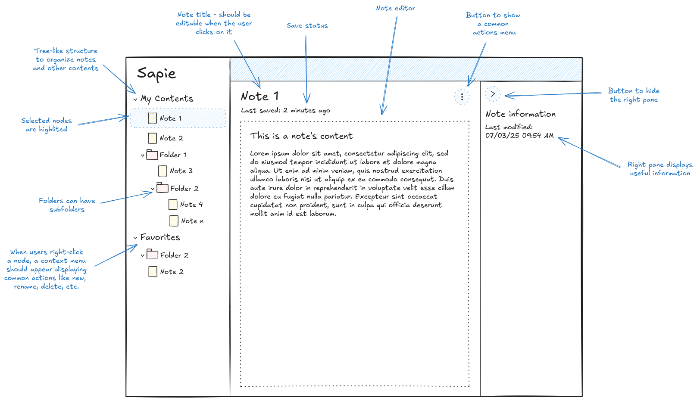

# Epic 45: Content Management Foundation

## Summary

Establish a robust foundation for users to create, organize, and manage their study content in a digital environment,
supporting intuitive navigation, editing, and contextual actions.

## Resources

1. Mockup: 

## Features

- [46-feature-content_navigation_and_organization.md](../../5-done/46-feature-content_navigation_and_organization.md)
- [47-feature-note_editing_and_management.md](../../2-features/1-ready/47-feature-note_editing_and_management.md)
- [48-feature-contextual_actions_and_user_experience.md](../../2-features/2-to-refine/48-feature-contextual_actions_and_user_experience.md)

## Related stories (content tree & note body track)

**Note body editing (sequence):** [Story 55](../../5-done/55-story-note_content_editor.md) (textarea + autosave MVP)
→ [Story 66](../../5-done/66-story-content_body_subdocument_and_client_cache.md) (nested `body` + TanStack cache)
→ [Story 67](../../3-stories/1-ready/67-story-rich_note_content_editor_mdx.md) (MDXEditor). **Concurrency / conflicts:**
[Story 65](../../3-stories/2-to-refine/65-story-note_body_concurrency_and_conflict_resolution.md) (after 67 unless reprioritized).

**Nested folders:** Tree behaviour is covered by [Story 50](../../5-done/50-story-nested_folders_support.md). **Creating**
folders (including nested) is [Story 63](../../3-stories/1-ready/63-story-folder_creation.md). Open a **new** story only if a
gap remains (e.g. max depth, UX, validation rules). **Moving** items to another parent is backlog until folder APIs and
permissions are settled (see MVP objective).

