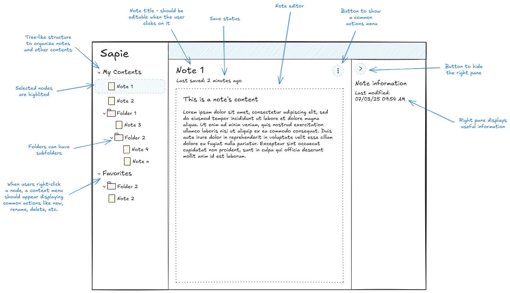

# Story 49: Implement Tree-Like Content Navigation Sidebar

## User Story

As a user, I want a tree-like sidebar to navigate my notes and folders so that I can easily organize and access my study
content.

## Epic Reference

- [Epic 45: Content Management Foundation](../1-epics/2-to-refine/45-epic-content_management_foundation.md)

## Feature Reference

- [Feature 46: Content Navigation & Organization](../2-features/2-to-refine/46-feature-content_navigation_and_organization.md)

## Resources

1. Mockup: 

---

## Acceptance Criteria

- [ ] Sidebar displays a tree structure of notes and folders loaded dynamically from the backend (API or Firestore)
- [ ] User can expand/collapse folders to reveal/hide nested notes and folders
- [ ] Loading state is shown while data is being fetched
- [ ] Error state is shown if data loading fails
- [ ] Sidebar updates when the underlying data changes (reactive or on refresh)
- [ ] Follows existing UI/UX patterns (Material-UI, consistent with app design)

## Technical Requirements

- Implement as a React component in the web package (`packages/web/src/components/`)
- Fetch data from backend (Firestore or API endpoint) representing the user's content tree
- Use Material-UI's TreeView or similar component for the UI
- Handle loading and error states gracefully
- Use TypeScript throughout
- Follow existing authentication and data access patterns
- Ensure code is linted, formatted, and type-safe

## Technical Details

- **Data Structure Example:**
  ```ts
  type TreeNode = {
    id: string;
    name: string;
    type: 'folder' | 'note';
    children?: TreeNode[];
  };
  ```
- **API/Firestore:**
    - Fetch the root directory and recursively load children
    - Use existing content service or create a new one if needed
- **Component Structure:**
    - `TreeNavigationSidebar` (main component)
    - May use helper components for tree nodes
- **UI/UX:**
    - Show loading spinner while fetching
    - Show error message if fetch fails
    - Allow expand/collapse of folders

## Iterative Approach ("Scooter" Version)

- Implement a minimal, working sidebar that loads and displays the user's content tree from the backend
- No advanced features (e.g., drag-and-drop, context menus, renaming) in this iteration
- Focus on end-to-end functionality: data loads, displays, and updates in the UI

## Tasks

- [ ] Implementation: Build the sidebar component, integrate data loading, handle loading/error states
- [ ] Testing: Add/verify tests for data loading and UI rendering (defer non-critical tests if needed, but document
  decision)
- [ ] Documentation: Update relevant docs and add usage notes for the new component 
