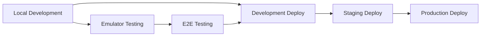

# Multi-Environment Deployment Strategy Research

## Overview

This document captures the research and implementation findings for supporting multi-environment deployments in the
Sapie knowledge management application, specifically addressing the challenge of deploying to different environments (
development, staging, production) when running `firebase deploy --only hosting`.

## Problem Statement

### Original Challenge

The application had environment-specific build scripts configured in `packages/web/package.json`:

```json
{
  "build": "tsc -b && vite build",
  "build:emulator": "tsc -b && NODE_ENV=development vite build --mode emulator",
  "build:staging": "tsc -b && NODE_ENV=production vite build --mode staging"
}
```

However, the `firebase.json` configuration was hardcoded to use the default `build` script:

```json
{
  "hosting": {
    "predeploy": [
      "cd packages/web && pnpm run build"
      // Always uses default build
    ]
  }
}
```

**Challenge**: How to automatically use the correct build script for each environment without manual intervention during
deployment.

### Requirements from Feature 5 (Multiple Environments Setup)

According to the [Feature 5: Multiple Environments Setup](../pm/4-in-progress/5-feature-multiple_environments_setup.md),
the application needs to support six distinct environments:

| Environment | Firebase Project | Purpose                                        |
|-------------|------------------|------------------------------------------------|
| emulator    | `demo-emulator`  | Full emulator development (default)            |
| test-e2e    | `demo-test-e2e`  | Automated testing                              |
| local       | `demo-local`     | Development with local servers + emulated auth |
| development | `sapie-dev`      | Development deployment                         |
| staging     | `sapie-staging`  | Pre-production validation                      |
| production  | `sapie-prod`     | Live application                               |

## Solution: Firebase Hosting Targets

### Approach Selected

**Firebase Hosting Targets** provide the most elegant solution by allowing multiple hosting configurations within a
single `firebase.json` file, each with environment-specific build scripts.

### Alternative Approaches Considered

1. **Multiple firebase.json files** - Complex to maintain and switch between
2. **Environment variable in build scripts** - Requires manual environment setting
3. **Conditional logic in predeploy scripts** - Complex scripting required
4. **Firebase Hosting Targets** - ✅ **Selected** - Clean, maintainable, built-in Firebase feature

## Implementation Details

### 1. Firebase Project Configuration (`.firebaserc`)

```json
{
  "projects": {
    "default": "demo-emulator",
    "emulator": "demo-emulator",
    "test-e2e": "demo-test-e2e",
    "local": "demo-local",
    "dev": "sapie-dev",
    "staging": "sapie-staging",
    "prod": "sapie-prod"
  },
  "targets": {
    "sapie-dev": {
      "hosting": {
        "dev": [
          "sapie-dev"
        ]
      }
    },
    "sapie-staging": {
      "hosting": {
        "staging": [
          "sapie-staging"
        ]
      }
    },
    "sapie-prod": {
      "hosting": {
        "prod": [
          "sapie-prod"
        ]
      }
    }
  }
}
```

**Key Changes:**

- Fixed syntax error (missing comma)
- Added all planned environment projects
- Configured hosting targets mapping environments to Firebase projects

### 2. Firebase Hosting Configuration (`firebase.json`)

```json
{
  "hosting": [
    {
      "target": "dev",
      "public": "packages/web/dist",
      "predeploy": [
        "cd packages/web && pnpm run build:dev"
      ]
      // ... other config
    },
    {
      "target": "staging",
      "public": "packages/web/dist",
      "predeploy": [
        "cd packages/web && pnpm run build:staging"
      ]
      // ... other config
    },
    {
      "target": "prod",
      "public": "packages/web/dist",
      "predeploy": [
        "cd packages/web && pnpm run build:prod"
      ]
      // ... other config
    },
    {
      // Default hosting config (no target)
      "public": "packages/web/dist",
      "predeploy": [
        "cd packages/web && pnpm run build"
      ]
      // ... other config
    }
  ]
}
```

**Key Features:**

- Multiple hosting configurations as array
- Each target uses environment-specific build script
- Default configuration maintained for backward compatibility
- Identical routing and file configurations across environments

### 3. Build Scripts (`packages/web/package.json`)

```json
{
  "scripts": {
    "build": "tsc -b && vite build",
    "build:emulator": "tsc -b && NODE_ENV=development vite build --mode emulator",
    "build:dev": "tsc -b && NODE_ENV=production vite build --mode development",
    "build:staging": "tsc -b && NODE_ENV=production vite build --mode staging",
    "build:prod": "tsc -b && NODE_ENV=production vite build --mode production"
  }
}
```

**Key Changes:**

- Added `build:dev` for development environment
- Added `build:prod` for production environment
- Consistent pattern: environment mode matches script suffix

### 4. Deployment Scripts (Root `package.json`)

```json
{
  "scripts": {
    "deploy:dev": "firebase deploy --only hosting:dev --project dev",
    "deploy:staging": "firebase deploy --only hosting:staging --project staging",
    "deploy:prod": "firebase deploy --only hosting:prod --project prod",
    "deploy:hosting": "firebase deploy --only hosting"
  }
}
```

**Key Features:**

- Environment-specific deployment commands
- Automatic project selection via `--project` flag
- Scoped to hosting only for safety
- Catch-all command for deploying to all environments

## Important Configuration Notes

### Firebase Emulator Hosting Targets

**Issue**: When using Firebase hosting targets, the emulator also requires these targets to be configured for demo projects, otherwise you'll get an error:

```
Error: Deploy target dev not configured for project demo-emulator. Configure with:
  firebase target:apply hosting dev <resources...>
```

**Solution**: Configure hosting targets for all demo projects in `.firebaserc`:

```json
{
  "targets": {
    "demo-emulator": {
      "hosting": {
        "dev": ["demo-emulator"],
        "staging": ["demo-emulator"],
        "prod": ["demo-emulator"]
      }
    },
    "demo-test-e2e": {
      "hosting": {
        "dev": ["demo-test-e2e"],
        "staging": ["demo-test-e2e"], 
        "prod": ["demo-test-e2e"]
      }
    },
    "demo-local": {
      "hosting": {
        "dev": ["demo-local"],
        "staging": ["demo-local"],
        "prod": ["demo-local"]
      }
    }
  }
}
```

**Why This Works**: Demo projects map all hosting targets to themselves, allowing the emulator to use any of the hosting configurations from `firebase.json` while maintaining proper isolation.

## Usage Examples

### Deploying to Specific Environments

```bash
# Deploy to development environment
pnpm run deploy:dev
# Internally runs: firebase deploy --only hosting:dev --project dev
# Automatically executes: cd packages/web && pnpm run build:dev

# Deploy to staging environment  
pnpm run deploy:staging
# Internally runs: firebase deploy --only hosting:staging --project staging
# Automatically executes: cd packages/web && pnpm run build:staging

# Deploy to production environment
pnpm run deploy:prod
# Internally runs: firebase deploy --only hosting:prod --project prod  
# Automatically executes: cd packages/web && pnpm run build:prod
```

### Traditional Firebase CLI Commands

```bash
# Direct Firebase CLI usage (also works)
firebase deploy --only hosting:staging --project staging
firebase deploy --only hosting:prod --project prod

# Deploy to all hosting targets
firebase deploy --only hosting
```

### Development Workflow Integration

```bash
# Local development (unchanged)
pnpm run emulator              # Starts Firebase emulator
pnpm run dev                   # Starts Vite dev server

# Testing before deployment
pnpm run build:staging         # Test staging build locally
pnpm run deploy:staging        # Deploy to staging
pnpm run deploy:prod           # Deploy to production after validation
```

## Technical Benefits

### 1. Automatic Environment-Specific Builds

**Before:**

```bash
# Manual process required
cd packages/web
pnpm run build:staging
cd ../..
firebase deploy --only hosting --project staging
```

**After:**

```bash
# Single command, automatic build selection
pnpm run deploy:staging
```

### 2. Environment Safety

- **Scoped deployments**: Cannot accidentally deploy to wrong environment
- **Project validation**: Firebase CLI validates project exists before deployment
- **Build validation**: Each environment gets its specific build configuration

### 3. Configuration Management

- **Centralized**: All environment configuration in single `firebase.json`
- **Maintainable**: Changes to hosting config apply to all environments
- **Consistent**: Identical routing and file handling across environments

### 4. Developer Experience

- **Intuitive commands**: `deploy:staging`, `deploy:prod` clearly indicate target
- **No manual steps**: Build script selection is automatic
- **Error prevention**: Impossible to deploy wrong build to environment

## Integration with Multi-Environment Strategy

### Alignment with Feature 5 Requirements

This implementation directly supports the multi-environment strategy:

1. **Safe Development Environments**: Emulator and local environments unaffected
2. **Isolated Testing Infrastructure**: test-e2e environment properly configured
3. **Production-Ready Deployment Pipeline**: Full dev → staging → prod pipeline
4. **Developer Experience Excellence**: Simple, clear deployment commands

### Environment Workflow Support



**Workflow Integration:**

- **Development Phase**: Use emulator environment for fast iteration
- **Integration Testing**: Deploy to development environment for validation
- **User Acceptance Testing**: Deploy to staging for stakeholder review
- **Production Release**: Deploy to production with confidence

### Story Implementation Support

This configuration supports implementation of related stories:

- **Story 41** (Setup Development Environment): `deploy:dev` command ready
- **Story 42** (Setup Staging Environment): `deploy:staging` command ready
- **Story 43** (Setup Production Environment): `deploy:prod` command ready
- **Story 44** (Finalize Environment Integration): Complete deployment pipeline

## Configuration Considerations

### Environment Variables Strategy

Each environment can use different Vite modes for configuration:

```
// .env.development (for build:dev)
VITE_API_BASE_URL = https://dev-api.sapie.app
VITE_FIREBASE_PROJECT_ID = sapie-dev

// .env.staging (for build:staging)  
VITE_API_BASE_URL = https://staging-api.sapie.app
VITE_FIREBASE_PROJECT_ID = sapie-staging

// .env.production (for build:prod)
VITE_API_BASE_URL = https://api.sapie.app  
VITE_FIREBASE_PROJECT_ID = sapie-prod
```

### Security Considerations

1. **Production Safety**: Production deployments require explicit `deploy:prod` command
2. **Project Isolation**: Each environment targets specific Firebase project
3. **Build Validation**: Environment-specific builds prevent configuration leaks
4. **Access Control**: Firebase project permissions control deployment access

### Performance Implications

- **Build Optimization**: Each environment gets optimized build for its purpose
- **Asset Management**: Environment-specific asset optimization via Vite modes
- **Caching Strategy**: Different caching strategies per environment possible

## Future Enhancements

### CI/CD Integration

```yaml
# GitHub Actions example
deploy_staging:
  runs-on: ubuntu-latest
  steps:
    - name: Deploy to Staging
      run: pnpm run deploy:staging

deploy_production:
  runs-on: ubuntu-latest
  needs: deploy_staging
  steps:
    - name: Deploy to Production
      run: pnpm run deploy:prod
```

### Monitoring Integration

- **Environment-specific monitoring**: Different alerting rules per environment
- **Performance tracking**: Environment-specific performance baselines
- **Error tracking**: Environment-tagged error reporting

### Advanced Deployment Features

- **Deployment validation**: Pre-deployment health checks
- **Rollback capabilities**: Automated rollback on deployment failure
- **Blue-green deployments**: Zero-downtime production deployments
- **Feature flags**: Environment-specific feature enablement

## Conclusion

The Firebase Hosting Targets solution provides a robust, maintainable approach to multi-environment deployments that:

1. **Eliminates manual build selection** through automatic environment-specific builds
2. **Prevents deployment errors** through scoped, environment-specific commands
3. **Supports the complete development lifecycle** from local development to production
4. **Integrates seamlessly** with the existing multi-environment strategy
5. **Provides foundation** for advanced deployment features and CI/CD integration

This implementation successfully addresses the original challenge while establishing a scalable foundation for the
multi-environment infrastructure defined in Feature 5.

## References

- [Feature 5: Multiple Environments Setup](../pm/4-in-progress/5-feature-multiple_environments_setup.md)
- [Firebase Hosting Targets Documentation](https://firebase.google.com/docs/cli/targets)
- [Vite Environment Variables](https://vitejs.dev/guide/env-and-mode.html)
- [Story 41: Setup Development Environment](../pm/3-stories/1-ready/41-story-setup_development_environment.md)
- [Story 42: Setup Staging Environment](../pm/3-stories/1-ready/42-story-setup_staging_environment.md)
- [Story 43: Setup Production Environment](../pm/3-stories/1-ready/43-story-setup_production_environment.md) 
